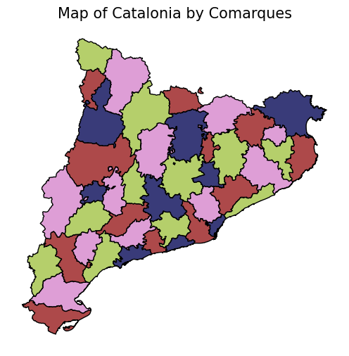

# Graph coloring problem

You can run the file main.py to obtain the optimal number of colors to paint Catalonia by Comarques. Also it is displayed in another window the correspondent colored map.

### Example result

### Folder structure

    ├── main.py                       # Execution file
    ├── adjacency_matrix.py           # This file contains the functions to create the adjacency matrix
    ├── graph_coloring_problem.py     # This file contains the functions to solve the graph coloring problem through Genetic Algorithms
    ├── paint_catalunya               # In this file are analysed the problem's results. 
    ├── results.csv                   # Hyperparameters search results using alphabetical sorting for the adjacency matrix.
    ├── sorted.csv                    # Hyperparameters search results using geaographical sorting for the adjacency matrix.
    ├── COMARQUES                     # Comarques shapefiles to obtain the graph and do the plots.
    ├── MUNICIPIS                     # Municipis shapefiles to obtain the graph and do the plots.
    ├── image_readme.png              # Image for the readme file exemplifying the result.
    └── README.md
